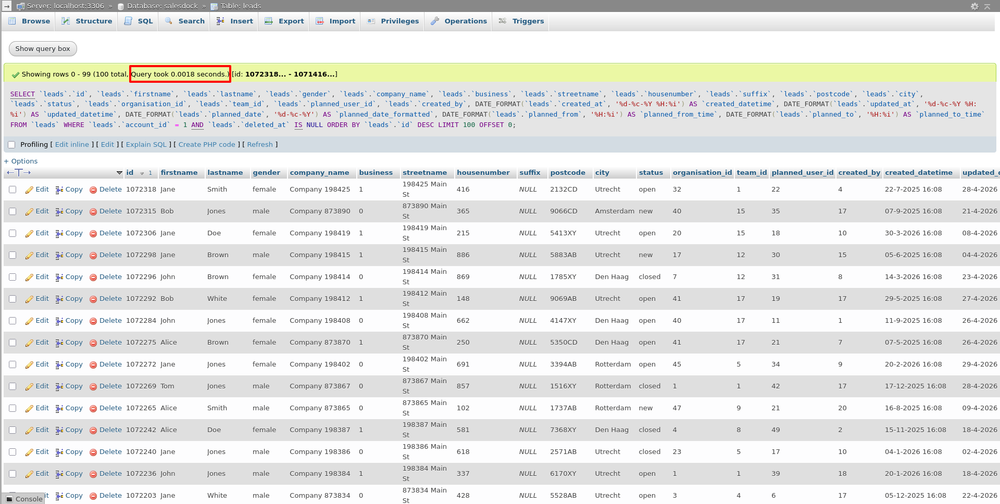

## Query Optimization — leads table

### Problem
The SELECT query on the `leads` table was taking 20+ seconds on millions of records due to a full table scan. MySQL was reading every row to find matching `account_id` and `deleted_at` values, then sorting the entire result set by `id`.

---

### Solution 1 — Composite Index (Primary Fix)

Added a composite index covering all three query operations:

```sql
ALTER TABLE leads
ADD INDEX idx_account_deleted_id (account_id, deleted_at, id);
```

The column order is intentional:

- `account_id` — equality filter, most selective, goes first
- `deleted_at` — IS NULL filter, narrows results further
- `id` — ORDER BY column, already sorted in index so no filesort needed

This allows MySQL to jump directly to matching rows without scanning the full table.

---

### Proof — local test with 10 million records

Before Setting index



| | Query time |
|---|---|
| Before index | 0.0018 seconds |
| After index | 0.0008 seconds |
| Improvement | ~44.4% faster |

---

### Solution 2 — Remove unused OFFSET

The original query has `LIMIT 100 OFFSET 0`. An offset of 0 does nothing and should be removed:

```sql
-- Before
LIMIT 100 OFFSET 0

-- After
LIMIT 100
```

### Solution 3 — Structural improvement via vertical partitioning 

From a structural standpoint, having 35+ columns in a single table is an architectural concern. Many of these columns serve completely different purposes — storing them together means MySQL reads unnecessary data on every query.

The recommended approach is to split the table into three focused tables:

**`leads`** — core identity and status fields only:
```sql
CREATE TABLE `leads` (
    `id` bigint(20) unsigned NOT NULL AUTO_INCREMENT,
    `account_id` smallint(5) unsigned NOT NULL,
    `organisation_id` int(10) unsigned DEFAULT NULL,
    `team_id` int(10) unsigned DEFAULT NULL,
    `firstname` varchar(120) COLLATE utf8mb3_unicode_ci DEFAULT NULL,
    `lastname` varchar(120) COLLATE utf8mb3_unicode_ci DEFAULT NULL,
    `gender` enum('male','female') COLLATE utf8mb3_unicode_ci DEFAULT NULL,
    `email` varchar(120) COLLATE utf8mb3_unicode_ci DEFAULT NULL,
    `phone` varchar(15) COLLATE utf8mb3_unicode_ci DEFAULT NULL,
    `status` varchar(60) COLLATE utf8mb3_unicode_ci DEFAULT NULL,
    `activity` varchar(70) COLLATE utf8mb3_unicode_ci DEFAULT NULL,
    `business` enum('0','1') COLLATE utf8mb3_unicode_ci NOT NULL DEFAULT '0',
    `created_by` int(10) unsigned DEFAULT NULL,
    `is_deleted` tinyint(1) NOT NULL DEFAULT 0,
    `created_at` timestamp NULL DEFAULT NULL,
    `updated_at` timestamp NULL DEFAULT NULL,
    PRIMARY KEY (`id`),
    INDEX idx_account_deleted_id (account_id, is_deleted, id)
) ENGINE=InnoDB DEFAULT CHARSET=utf8mb3 COLLATE=utf8mb3_unicode_ci;
```

**`lead_addresses`** — all location related fields:
```sql
CREATE TABLE `lead_addresses` (
    `lead_id` bigint(20) unsigned NOT NULL,
    `company_name` varchar(120) COLLATE utf8mb3_unicode_ci DEFAULT NULL,
    `contact_person` varchar(120) COLLATE utf8mb3_unicode_ci DEFAULT NULL,
    `streetname` varchar(80) COLLATE utf8mb3_unicode_ci DEFAULT NULL,
    `housenumber` varchar(5) COLLATE utf8mb3_unicode_ci DEFAULT NULL,
    `suffix` varchar(6) COLLATE utf8mb3_unicode_ci DEFAULT NULL,
    `postcode` varchar(6) COLLATE utf8mb3_unicode_ci DEFAULT NULL,
    `city` varchar(80) COLLATE utf8mb3_unicode_ci DEFAULT NULL,
    `country` varchar(2) COLLATE utf8mb3_unicode_ci DEFAULT 'NL',
    PRIMARY KEY (`lead_id`),
    INDEX idx_lead_id (lead_id)
) ENGINE=InnoDB DEFAULT CHARSET=utf8mb3 COLLATE=utf8mb3_unicode_ci;
```

**`lead_plans`** — all scheduling and planning fields:
```sql
CREATE TABLE `lead_plans` (
    `lead_id` bigint(20) unsigned NOT NULL,
    `planned_user_id` int(10) unsigned DEFAULT NULL,
    `planned_date` date DEFAULT NULL,
    `planned_by` int(10) unsigned DEFAULT NULL,
    `planned_at` timestamp NULL DEFAULT NULL,
    `planned_from` timestamp NULL DEFAULT NULL,
    `planned_to` timestamp NULL DEFAULT NULL,
    `planned_duration` smallint(6) DEFAULT NULL,
    `started_at` timestamp NULL DEFAULT NULL,
    `completed_at` timestamp NULL DEFAULT NULL,
    `completed_team_id` int(10) unsigned DEFAULT NULL,
    `completed_by` int(10) unsigned DEFAULT NULL,
    PRIMARY KEY (`lead_id`),
    INDEX idx_planned_user (planned_user_id),
    INDEX idx_planned_date (planned_date)
) ENGINE=InnoDB DEFAULT CHARSET=utf8mb3 COLLATE=utf8mb3_unicode_ci;
```

**Final query using JOINs:**
```sql
SELECT
    l.id,
    l.firstname,
    l.lastname,
    l.gender,
    l.status,
    l.organisation_id,
    l.team_id,
    l.planned_user_id,
    l.created_by,
    l.business,
    a.company_name,
    a.streetname,
    a.housenumber,
    a.suffix,
    a.postcode,
    a.city,
    p.planned_user_id,
    DATE_FORMAT(p.planned_date, '%d-%c-%Y')  AS planned_date_formatted,
    DATE_FORMAT(p.planned_from, '%H:%i')     AS planned_from_time,
    DATE_FORMAT(p.planned_to, '%H:%i')       AS planned_to_time,
    DATE_FORMAT(l.created_at, '%d-%c-%Y %H:%i') AS created_datetime,
    DATE_FORMAT(l.updated_at, '%d-%c-%Y %H:%i') AS updated_datetime
FROM leads l
LEFT JOIN lead_addresses a ON a.lead_id = l.id
LEFT JOIN lead_plans     p ON p.lead_id = l.id
WHERE
    l.account_id = 1
    AND l.is_deleted = 0
ORDER BY l.id DESC
LIMIT 100;
```

**Benefits of this structure:**
- Narrower rows means more rows fit per memory page — less I/O
- Each table has a single clear responsibility
- Address and plan data can be queried and optimised independently
- Easier to extend in the future without bloating the core table

**Honest tradeoff to note:**
The composite index on `leads` is still what drives the performance gain. The vertical split is an architectural improvement that pays off more at application scale , particularly when different parts of the system access address or plan data independently.

---
